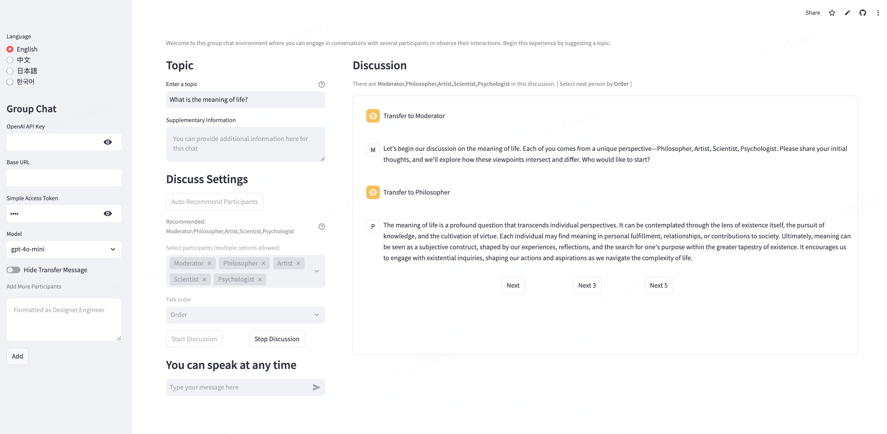

# Multi Agent Framework

## Introduction

Multi-Agent Framework build from scratch, based on OpenAI API, to enable multiple agents to talk to each other, perform tasks, and handle basic control with a human in the loop.

You can also add third-party agents like Dify to the group, and the framework will automatically handle the handoff between agents.

It is built to be flexible and user-friendly, enabling users to create and manage groups of agents with various roles and skills. This framework can be applied in many areas, such as customer support, research, and education.

## Simple Demo



Try it: [Simple demo for multi-agent](https://agentstalk.streamlit.app/)

## Tutorial

- [How to build Group of Agents](examples/001%20group.ipynb)
- [Chat with Group of Agents](examples/002%20chat.ipynb)
- [Internal dialogue within Group of Agents](examples/003%20dialogue.ipynb)
- [Task for Group of Agents](examples/004%20task.ipynb)
- [Low Level API for Group Discussion with Human in the Loop](examples/999%20low-level.ipynb)


## Usage

### Pre-requirements

```bash
pip install -r requirements.txt
cp .env_example .env
```

write your own KEY and URL(optional)

```
OPENAI_API_KEY=xxx
OPENAI_BASE_URL=xxx
```

### Step Zero

```python
from dotenv import load_dotenv
from openai import OpenAI
from src import Env,Agent,Group

load_dotenv()
model_client = OpenAI()
```

### Step One

> Agent is the basic unit of the framework, it can build from scratch or connect to third-party agents

Creat Agent like this 

```python
artist = Agent(name="artist",
        role="Artist", 
        description="Transfer to me if you need help with art.",
        persona = "You are a professional artist who has been working in the industry for over 10 years. You have a deep understanding of art history and have a strong passion for creating art. You are known for your unique style and innovative approach to art. You are always looking for new ways to express yourself and push the boundaries of what is possible in the art world.",
        model_client=model_client,
        verbose=True)
```

can use agent like this

```python
response = artist.do("Can you help me with art?",model="gpt-4o-mini")
```

can add tools like this

```python

def web_search(qury:str)->str:
    """
    web search tool
    """
    # do web search
    return "web search result"

artist = Agent(name="researcher",
        role="Researcher",
        description="Transfer to me if you need help with research.",
        persona = "You are a professional researcher who can do web search to conduct research on a wide range of topics. You have a deep understanding of how to find and evaluate information from a variety of sources. You are known for your ability to quickly find relevant information and present it in a clear and concise manner.",
        tools=[web_search],
        model_client=model_client,
        verbose=True)
```

or connect a third-party agent that was created at Dify like this.

```python
mathematician = Agent(name="mathematician",
    role="Mathematician", 
    description="Transfer to me if you need help with math.", 
    dify_access_token="app-rlK8IzzWCVkNbkxxxxxxx",
    verbose=True)
# persona is not needed for Dify agent, it already has its own persona
```

or connect a websocket agent like this.

```python
agent = Agent(name="assistant", 
              role="Assistant",
              description="Transfer to me if you need help",
              websocket_url="ws://localhost:5358/ws_agent_demo",
              verbose=True)
```


### Step Two

> Env is the environment where agents live, you can add a description and agents to the environment. In addition,it can be created with or without relationships between agents, and can also set the language used in the environment. Env will be used to create a group of agents.

Create Env like this (all agents are fully connected by default)

```python

env = Env(
    description="This is a test environment",
    members=[mathematician, artist]
)
```

or like this (self-defined topology relationships between agents)

```python
env = Env(
    description="This is a test environment",
    members=[mathematician, artist],
    relationships={"agent1": ["agent2"]}
)
```

or set language used in the environment

```python
env = Env(
    description="This is a test environment",
    members=[mathematician, artist],
    language="中文"
)
```


### Step Three

> Group is a collection of agents that can be used to chat, perform tasks, and handle basic control with a human in the loop.

Build Group like this

```python
g = Group(env=env,model_client=model_client,verbose=True)
```

can add extra agent into group dynamically like this

```python

designer = Agent(name="designer",
    role="Designer", 
    description="Transfer to me if you need help with design.", 
    model_client=OpenAI(),
    verbose=True)

g.add_member(designer)
```

or delete agent from group dynamically like this (return takeaway is the group message summary for the agent)

```python
takeaway = g.delete_member("artist") # delete by name
```

or invite agent to join group dynamically like this

```python
# automatically create agent
g.invite_member("a philosopher who calls himself agent4 , he is a big fan of plato and aristotle")
```

or dismiss the group (each agent will review the takeaway for themselves based on what happened in the group)

```python
g.dismiss_group()
```

### Step Four

Some examples of how to use the group


```python
response= g.chat("Can you explain the concept of complex numbers?",model="gpt-4o-mini")
response= g.chat("Can you help me with art?",model="gpt-4o-mini")
```

```python
g.dialogue(model="gpt-4o-mini",max_turns=10)
```

```python
response = g.task("I want to build a simplistic and user-friendly bicycle help write a design brief.",model="gpt-4o-mini",strategy="auto")
```

low-level API example

```python
g.user_input("can you help me with math?")
next_agent = g.handoff(next_speaker_select_mode="auto",include_current=True,model="gpt-4o-mini")
```

```python
g.user_input("Discuss the concept of abstract art.")
response = g.call_agent(next_speaker_select_mode="auto",include_current=True,model="gpt-4o-mini")
response = g.call_agent(next_speaker_select_mode="auto",include_current=True,model="gpt-4o-mini")
g.user_input("how do you feel about abstract art?")
response = g.call_agent(next_speaker_select_mode="auto",include_current=True,model="gpt-4o-mini")
response = g.call_agent(next_speaker_select_mode="auto",include_current=True,model="gpt-4o-mini")
response = g.call_agent(next_speaker_select_mode="auto",include_current=True,model="gpt-4o-mini")
```

